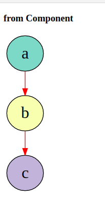

# dot

[](https://app.netlify.com/sites/gifted-ramanujan-14d635/deploys)

:rocket: [Click here to Live website][url]



## :sunrise: Project setup

```
yarn install
```

### :running: Compiles and hot-reloads for development

```
yarn serve
```

### :runner: Compiles and minifies for production

```
yarn build
```

### :mag: Lints and fixes files

```
yarn lint
```

### :hammer: Customize configuration

See [Configuration Reference](https://cli.vuejs.org/config/).

## :beetle: Limitations

Doesnt work with multiple components calls on same page. As component uses `id` for element selection
and then updation

## :dolphin: Notes

```
npx create-nuxt-app graphvizEg
yarn add d3 d3-graphviz @hpcc-js/wasm

http://localhost:3000/_content
```

#### Get in touch with me

> I am looking for Jobs ... :sunglasses:

* [Github](https://github.com/avimehenwal/)
* [My Website](https://avimehenwal.in)
* [My Blog v2](https://avimehenwal2.netlify.app/)
* [Twitter Handle](https://twitter.com/avimehenwal)
* [LinkedIn](https://in.linkedin.com/in/avimehenwal)
* [Stackoverflow](https://stackoverflow.com/users/1915935/avi-mehenwal)

<a href="https://www.buymeacoffee.com/F1j07cV" target="_blank"></a>

 Spread Love :hearts: and not :no_entry_sign: hatred   [](https://twitter.com/avimehenwal)


[url]: https://gifted-ramanujan-14d635.netlify.app/