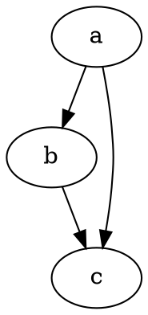
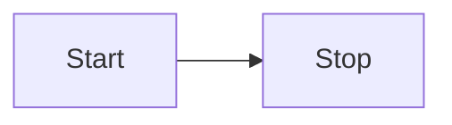

<dot id="sample1"></dot>

<dot id="sample2"></dot>

### dot code block

### Latex

$$c = m + 2$$

### Containers

::: tip
content
:::

::: tip title
content

muliti line
:::

### Emojis

:dog: :+1:

### Abbreviations

This plugin works on MDAST.

More stuff about MDAST.

*[MDAST]: Markdown Abstract Syntax Tree

Empower your NuxtJS application with `@nuxtjs/content` module: write in a `content/` directory and fetch your Markdown, JSON, YAML and CSV files through a MongoDB like API, acting as a **Git-based Headless CMS**.

## Writing content

Learn how to write your `content/`, supporting Markdown, YAML, CSV and JSON: https://content.nuxtjs.org/writing.

## Fetching content

Learn how to fetch your content with `$content`: https://content.nuxtjs.org/fetching.

## Displaying content

Learn how to display your Markdown content with the `<nuxt-content>` component directly in your template: https://content.nuxtjs.org/displaying.

* https://github.com/sschoger/heroicons-ui/tree/master/svg

